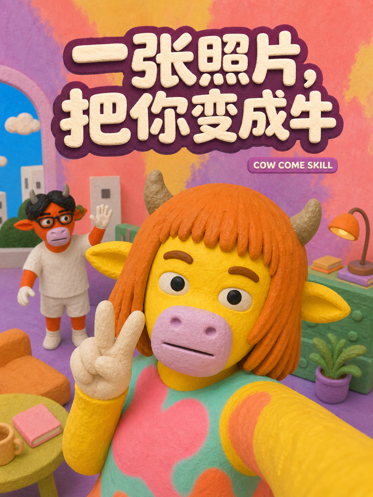
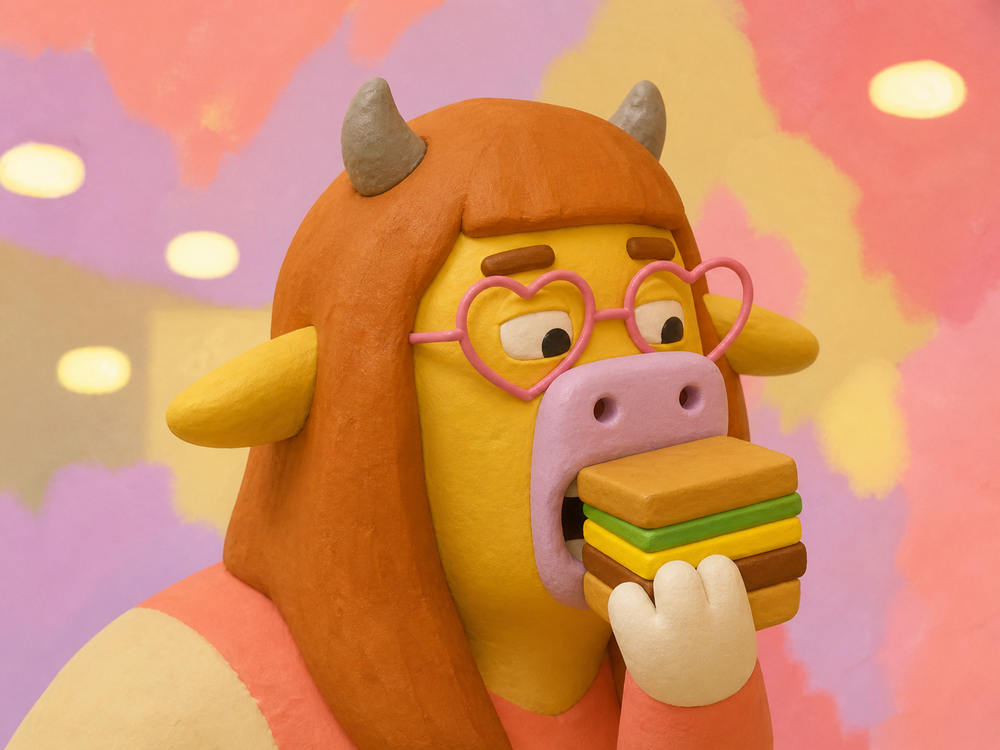
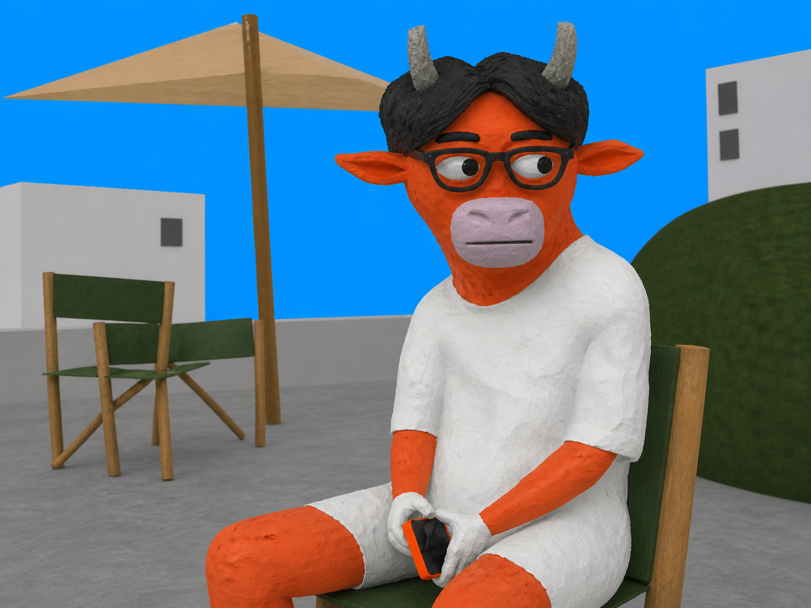
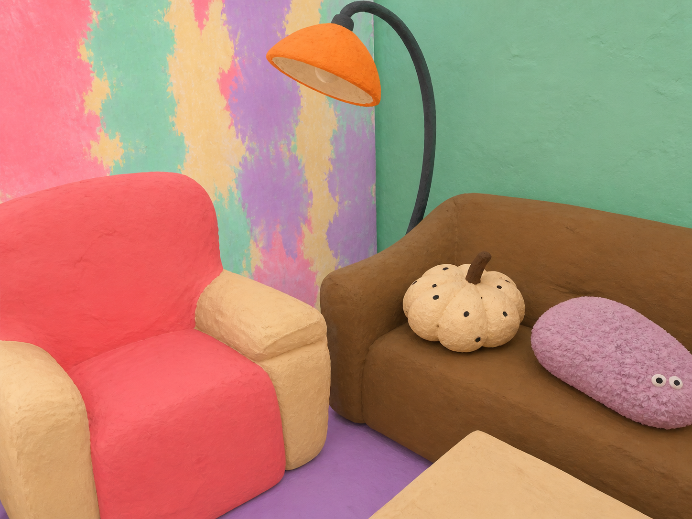
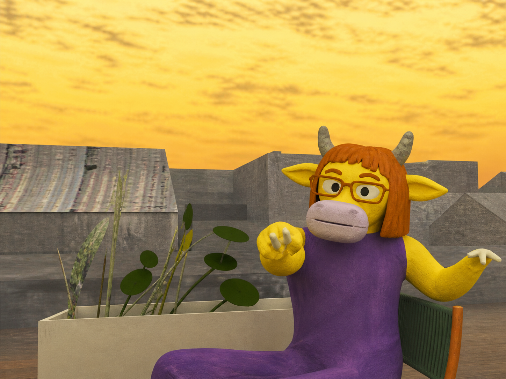
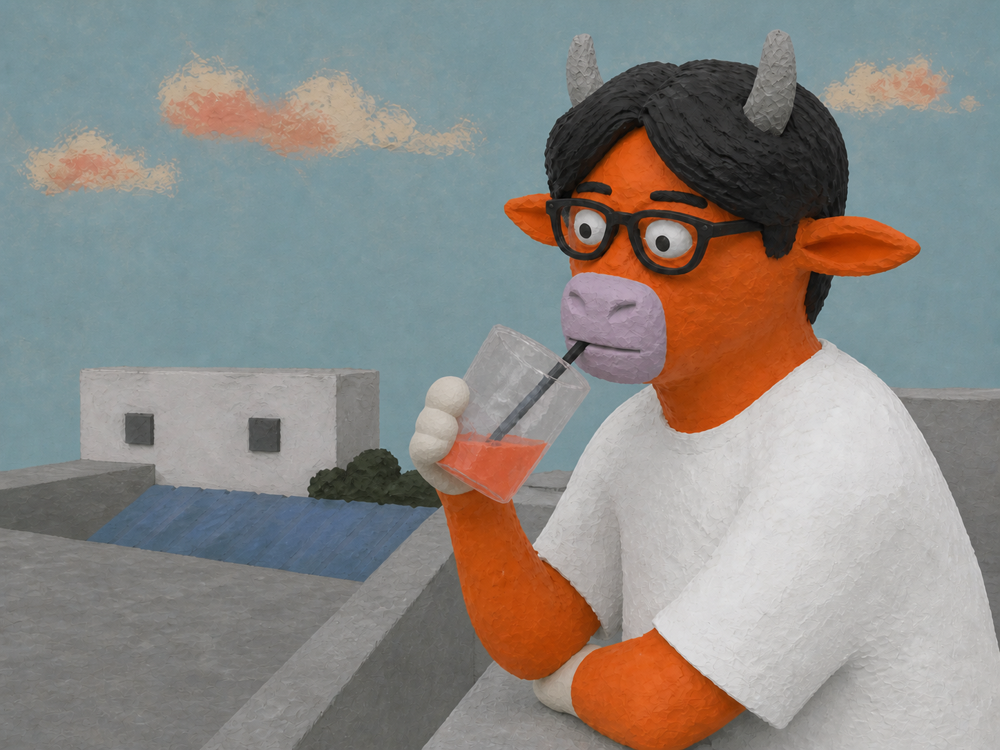
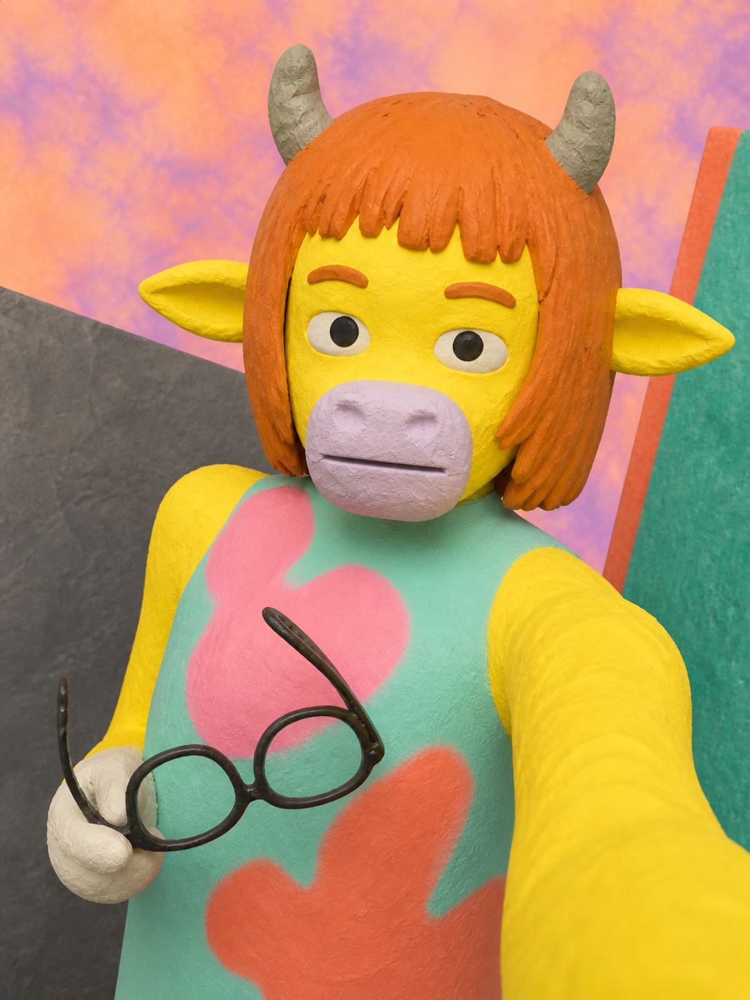

# You Me Everybody Cow Come

The original, full Codex skill for transforming source photographs into the established Cow Come visual style.

This repository contains the complete skill instructions, detailed style specification, Codex interface metadata, and the visual calibration assets used by the skill.

## Examples















## Install

Copy this repository into your Codex skills directory so that `SKILL.md` is located at:

```text
$CODEX_HOME/skills/you-me-everybody-cow-come/SKILL.md
```

Restart or reload Codex after installation, then invoke the skill as `$you-me-everybody-cow-come`.

## Contents

- `SKILL.md` — main workflow and generation rules
- `references/style-spec.md` — detailed visual construction specification
- `references/legacy-ocean-assets.md` — optional ocean-scene reference notes
- `agents/openai.yaml` — Codex interface metadata
- `assets/` — authoritative targets and supporting calibration boards

## Image assets

The repository includes generated Cow Come calibration targets and showcase images. Original source photographs are not included.
